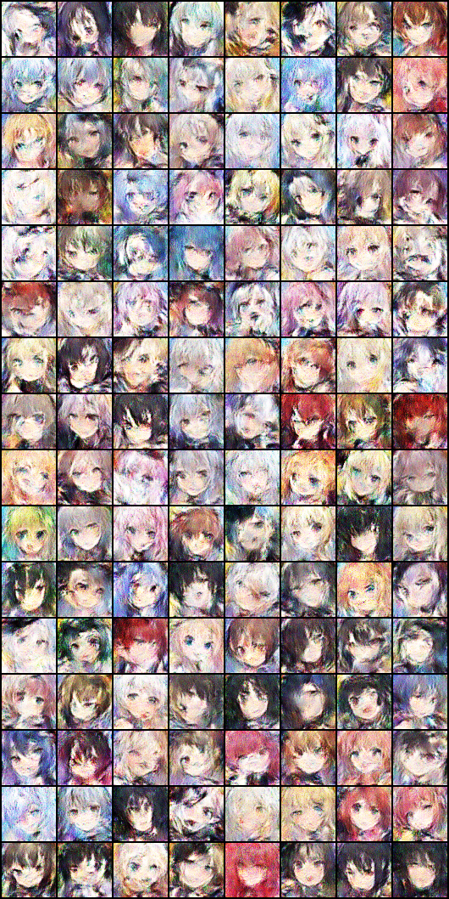
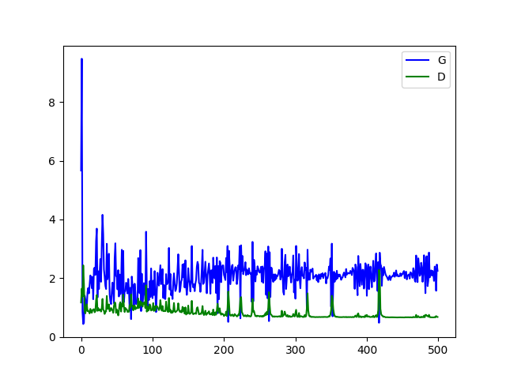

# GAN - 生成对抗网络
参考: https://pytorch.org/tutorials/beginner/dcgan_faces_tutorial.html





## Usage

```
usage: main.py [-h] [-r RATE] [-b BATCH] [-e EPOCH] [-m MODEL] [-d DATA] [-f FILE]

MNIST GAN Demo

options:
  -h, --help            show this help message and exit
  -r RATE, --rate RATE  learing rate
  -b BATCH, --batch BATCH
                        batch size
  -e EPOCH, --epoch EPOCH
                        epoches
  -m MODEL, --model MODEL
                        model file
  -d DATA, --data DATA  dataset path
  -f FILE, --file FILE  file of generating, None for training
```

**生成图片**:  

```
./main.py -m azre_lane_avatar.pt -g 1.png
```

**训练**:  
```
./main.py -m azre_lane_avatar.pt 
```

## 数据获取

运行 `download.py` 即可下载来自 [碧蓝航线Wiki](https://wiki.biligame.com/blhx/%E8%88%B0%E8%88%B9%E5%9B%BE%E9%89%B4) 的舰船头像作为训练数据

> 另外推荐使用 Kaggle 上的 [Anime Face Dataset](https://www.kaggle.com/datasets/splcher/animefacedataset)